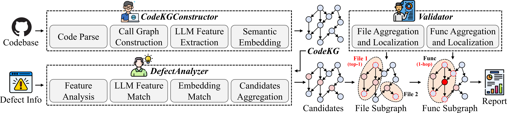

# 🔍 LLMSDL

## 🚀 Getting Started

```bash
cd LLMSDL
# Environment
conda create -n llmsdl python=3.10.16
conda activate llmsdl
pip install -r requirements.txt

# Configure project path
# 1. cd src
# 2. Edit utils.py: PROJECT_PATH
```

- **LLM Model**: OpenAI SDK compatible (Must support function calling) 
- **Embedding Model**: OpenAI SDK compatible

---

### Single Repository Analysis
- example: datasets/llmdd/0__0__Shaunwei__RealChar
- defect_description: "The LLM's answers sometimes contradict the truth or the content of the uploaded file"
- defect_reproduction: "1.In the RealChar UI, select a character to converse with.\n2.Ask ambiguous questions."

```bash
cd src
python main.py \
  --base_url "xxx" \
  --api_key "xxx" \
  --model "xxx" \
  --embedding_url "xxx" \
  --embedding_key "xx" \
  --embedding_model "xxx"

# results: src/results/localization

python run_main_single.py -h # see more parameters
```

---

### All Repository Analysis
- Download all dataset from: https://drive.google.com/file/d/1QINR1uTBXBXqN_letSobMnAWLRSqjugH

```bash

cd datasets
unzip llmdd.zip
# final path: LLMSDL/datasets/llmdd
cd src
# 1.Edit utils.py: model_name_url_list
# 2.Edit run_main.py: api_key, embedding_url, embedding_key, embedding_model
python run_main.py

# results: LLMSDL/results
```
---

## 🌟 What is LLMSDL?

**LLMSDL: LLM-Specific Defect Localization Using Knowledge Graph-Enhanced Multi-Agents**

LLMSDL is a specialized framework designed to locate defects in LLM-based software systems. Unlike traditional defect localization tools, LLMSDL understands the unique characteristics of LLM-specific defects that occur at software-LLM interaction boundaries.




Challenges:

1. **C1**: LLM-specific defects concentrate (94.3%) at software-LLM interaction boundaries
2. **C2**: These defects show higher complexity than traditional defects (25.75% longer resolution time)
3. **C3**: Existing techniques achieve only 50.99% top-1 accuracy on LLM-specific defects


Key advantages:
- 🎯 **LLM-Focused**: Specifically designed for LLM-specific defects in LLM-based software systems
- 🧠 **Multi-Agent Architecture**: Uses three specialized agents for comprehensive analysis
- 📊 **Knowledge Graph**: Builds code knowledge graphs to capture LLM interaction semantics
- 🔍 **Context-Aware**: Performs hierarchical validation with call relationship analysis

- **Superior Performance**: 60.26% top-1 accuracy, 18.2% improvement over best baseline
- **Cost Efficient**: Uses 93.0% fewer tokens than existing approaches while maintaining accuracy

Framework:

1. **Code Knowledge Graph Constructor Agent**: Builds comprehensive code knowledge graph with LLM interaction semantics
2. **Defect Analyzer Agent**: Interprets defect descriptions and performs static + embedding-based matching
3. **Validator Agent**: Conducts call relationship subgraph analysis and hierarchical evaluation

## 📊 Performance Results

LLMSDL significantly outperforms existing defect localization techniques:
- **60.26%** top-1 accuracy (vs. 50.99% best baseline)
- **18.2%** improvement over SWE-agent
- **36.8%** improvement over Agentless
- **25.5%** improvement over AutoCodeRover
- **93.0%** fewer tokens used compared to SWE-agent


## 📁 Project Structure

```bash
LLMSDL/
├── src/
│   ├── run_main_single.py    # Main single repository analysis
│   ├── run_main.py          # Batch processing script
│   ├── results_main.py      # Results analysis utilities
│   └── utils.py             # Common utilities and configurations
├── datasets/
│   ├── llmdd/               # LLM defect dataset
│   └── llmdd_defect.csv     # Defect metadata
├── paper/
│   └── 1framework_00.png    # Framework diagram
├── requirements.txt         # Python dependencies
└── README.md               # This file
```
